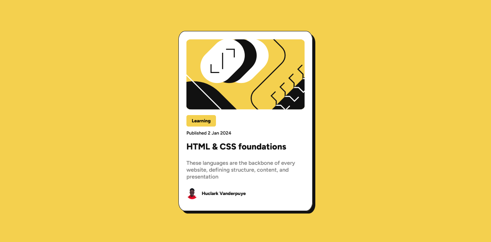

# Blog preview card solution

This is a solution to the [Blog preview card challenge on Frontend Mentor](https://www.frontendmentor.io/challenges/blog-preview-card-ckPaj01IcS). Frontend Mentor challenges help you improve your coding skills by building realistic projects.

## Table of contents

- [Overview](#overview)
  - [The challenge](#the-challenge)
  - [Screenshot](#screenshot)
  - [Links](#links)
- [My process](#my-process)
  - [Built with](#built-with)
  - [What I learned](#what-i-learned)
- [Author](#author)

## Overview

### The challenge

Users should be able to:

- See hover and focus states for all interactive elements on the page

### Screenshot



### Links

- Solution URL: [Add solution URL here](https://your-solution-url.com)
- Live Site URL: [Add live site URL here](https://your-live-site-url.com)

## My process

### Built with

- HTML
- CSS

### What I learned

Of all the things I learnt and implemented, being able to create a transition upon the cursor hovering on the element was what stood out for me.

Here's the code snippet of how i implemented the hover effect:

```css
.text-link {
  color: inherit;
  text-decoration: none;
  transition: color 0.4s;
}

.text-link:hover {
  color: hsl(47, 88%, 63%);
  transition-delay: 0.2s;
}
```

## Author

<!-- - Website - [Add your name here](https://www.your-site.com) -->

- Frontend Mentor - [@Huclark](https://www.frontendmentor.io/profile/Huclark)
- Twitter - [@huclark\_](https://www.twitter.com/huclark_)
